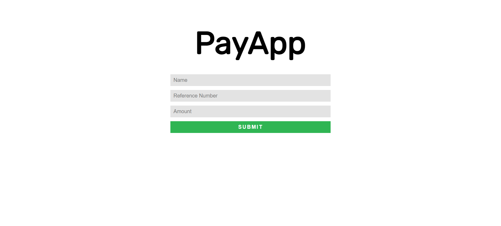
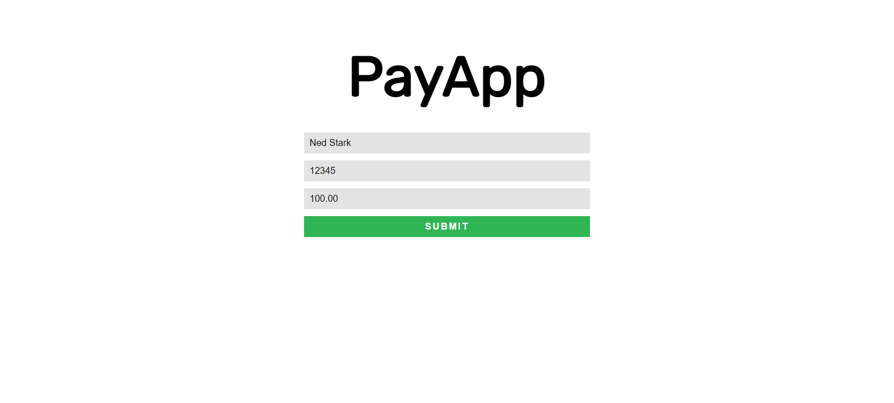
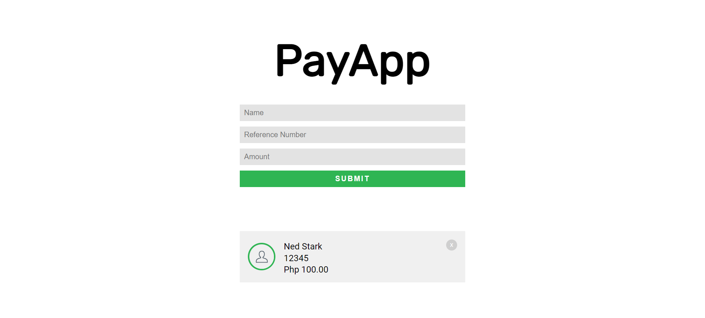
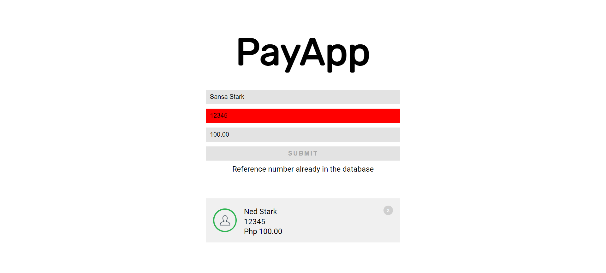

# Payment Transaction Tracker
My Mini Challenge 3 solution, in partial fulfillment of the requirements for the course, Web Application Development (CCAPDEV).

## Local Set Up
- Make sure MongoDB is installed and running.
- Run `npm install` after [downloading the contents of the repository](https://github.com/arvention/ccapdev-2021t2-mc03/archive/refs/heads/main.zip).
- To run the application, execute `node index.js`

## Content
- [`controllers`](controllers) - This folder contains files which defines callback functions for client requests.
- [`misc`](misc) - This folder contains images used in the [`README.md`](README.md) file.
- [`models`](models) - This folder contains files for database modeling and access.
- [`public`](public) - This folder contains static assets such as css, js, and image files.
- [`routes`](routes) - This folder contains files which describes the response of the server for each HTTP method request to a specific path in the server.
- [`views`](views) - This folder contains all hbs files to be rendered when requested from the server.
- [`index.js`](index.js) - The main entry point of the web application.

## Project Description
A web application which simulates an online payment transaction tracker.

The web application accepts three inputs - a name, a reference number, and an amount. When the user submits the form, the web application first checks if all fields are filled. Sample user input:

The picture below shows the error message when at least one of the form fields is not filled-up:

The picture below shows how the web application should display the values that we have entered earlier:

The picture below shows the changes in the form if the current value in the `refno` text field is already in the database:

If ever we refresh the web application, all transactions in the database should be displayed.

## References
Materials uploaded for the course and resources readily available on the internet.

* [ccapdev-ajax](https://github.com/arvention/ccapdev-ajax) code sample
* [ccapdev-mongoose](https://github.com/arvention/ccapdev-mongoose) code sample
